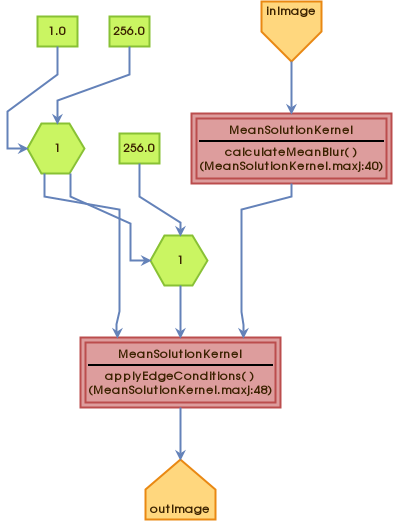
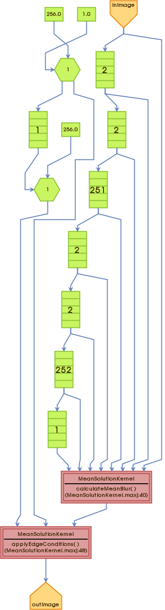

# Mean Blur Algorithm

## Introduction
Image processing plays a pivotal role in various fields, from computer vision and medical imaging to photography and graphic design. One fundamental technique in image processing is blurring, a process that reduces the sharpness of an image or eliminates high-frequency noise. Mean blur, also known as average blur, is a widely used blurring algorithm that involves replacing each pixel in an image with the average value of its neighboring pixels. In this exploration, we will delve into the intricacies of the mean blur algorithm, its applications, and the underlying mathematics.

## Mean Blur Algorithm
The mean blur algorithm is a simple yet effective technique used for smoothing or blurring an image. The core idea behind mean blur is to replace the color value of each pixel with the average value of its neighboring pixels. The size of the neighborhood is determined by a predefined kernel or filter. The kernel is usually a square matrix with odd dimensions (3x3, 5x5, etc.), centered around the pixel being processed.

### Steps of the Mean Blur Algorithm
1. **Selecting the Kernel Size:**
   The first step is to choose the size of the kernel, which determines the extent of blurring. A larger kernel implies a more significant smoothing effect but can lead to the loss of finer details.
2. **Centering the Kernel:**
   The kernel is centered around each pixel. For each pixel, the algorithm calculates the average of the color values within the kernel.
3. **Updating Pixel Values:**
   Replace the original color value of the pixel with the computed average. This process is repeated for every pixel in the image.

### Mathematical Representation
The mean blur operation for a pixel (x, y) with a 3x3 kernel can be represented mathematically as follows:

$` \text{NewValue}(x, y) = \frac{1}{9} \sum_{i=-1}^{1} \sum_{j=-1}^{1} \text{OriginalValue}(x + i, y + j) `$

Here, $`( \text{OriginalValue}(x, y)`$ represents the color value of the pixel at coordinates (x, y) in the original image, and $` \text{NewValue}(x, y)`$ is the updated value after applying the mean blur.

## Applications
1. **Noise Reduction:**
   Mean blur is often used to mitigate noise in images, especially in low-light conditions or high ISO settings in photography. The averaging of pixel values helps to smooth out random variations.
2. **Preprocessing for Edge Detection:**
   Prior to edge detection algorithms, applying mean blur can enhance the performance by reducing small-scale variations in intensity, highlighting larger structures.
3. **Image Smoothing:**
   Mean blur is a popular choice for general image smoothing. It helps in creating a softer appearance, reducing sharp transitions between colors.
4. **Privacy Protection:**
   In privacy-sensitive applications, mean blur can be applied to anonymize or obscure certain regions of an image, such as faces or license plates.

## Challenges and Considerations
While mean blur is a simple and computationally efficient algorithm, it has its limitations. One major drawback is the loss of fine details and edges in the image. The blurring effect can lead to a lack of sharpness, making it unsuitable for applications where preserving intricate details is crucial.
Moreover, mean blur is sensitive to outliers and extreme values in the neighborhood, which can result in undesired artifacts, especially in the presence of salt-and-pepper noise.

## Conclusion
The mean blur algorithm is a foundational tool in the realm of image processing. Its simplicity, coupled with its effectiveness in reducing noise and smoothing images, makes it a go-to choice in various applications. Understanding the mathematical basis of the mean blur operation provides insights into its functioning and aids in making informed decisions when applying this algorithm in different contexts.
As technology continues to advance, more sophisticated blurring techniques are being developed, but the mean blur algorithm remains a valuable and widely used tool in the toolkit of image processing professionals and enthusiasts alike.

## Applications
The mean blur algorithm finds diverse applications across different domains:
### 1. Image Smoothing
Mean blur is commonly used for image smoothing, reducing noise, and providing a visually more pleasing appearance. This is beneficial in various fields, including medical imaging and surveillance.
### 2. Preprocessing for Object Recognition
In computer vision, mean blur serves as a preprocessing step for object recognition. It helps emphasize essential features while reducing the impact of irrelevant details, leading to improved accuracy.
### 3. Edge Detection
While primarily a smoothing operation, mean blur indirectly influences edge detection. By softening edges and suppressing minor details, the algorithm contributes to highlighting more prominent structures.
### 4. Noise Reduction in Satellite Imagery
In satellite imagery, mean blur aids in reducing noise and enhancing the clarity of significant geographical features. This is valuable for tasks such as land cover classification and environmental monitoring.

## Mean Blur in Maxeller

```java
package mean;

import com.maxeler.maxcompiler.v2.kernelcompiler.Kernel;
import com.maxeler.maxcompiler.v2.kernelcompiler.KernelParameters;
import com.maxeler.maxcompiler.v2.kernelcompiler.stdlib.core.CounterChain;
import com.maxeler.maxcompiler.v2.kernelcompiler.types.base.DFEVar;

class MeanSolutionKernel extends Kernel {

    private static final int NEIGHBORHOOD_SIZE = 3;
    private static final int MEAN_DIVISOR = NEIGHBORHOOD_SIZE * NEIGHBORHOOD_SIZE;

    protected MeanSolutionKernel(KernelParameters parameters) {
        super(parameters);
        int height = 256;
        int width = 256;

        DFEVar inImage = io.input("inImage", dfeInt(32));

        DFEVar result = calculateMeanBlur(inImage, height, width);

        CounterChain counterChain = control.count.makeCounterChainMoreBits();
        DFEVar y = counterChain.addCounter(height, 1);
        DFEVar x = counterChain.addCounter(width, 1);

        result = applyEdgeConditions(result, x, y, width, height);

        io.output("outImage", result, result.getType());
    }

    private DFEVar calculateMeanBlur(DFEVar inImage, int height, int width) {
        DFEVar sum = constant.var(0);

        for (int x = -NEIGHBORHOOD_SIZE / 2; x <= NEIGHBORHOOD_SIZE / 2; x++) {
            for (int y = -NEIGHBORHOOD_SIZE / 2; y <= NEIGHBORHOOD_SIZE / 2; y++) {
                sum = sum + stream.offset(inImage, y * width + x);
            }
        }
        return sum / MEAN_DIVISOR;
    }

    private DFEVar applyEdgeConditions(DFEVar result, DFEVar x, DFEVar y, int width, int height) {
        DFEVar isInsideImage = (x > 0) & (x < width - 1) & (y > 0) & (y < height - 1);
        return isInsideImage ? result : constant.var(0);
    }
}
```

### Code Structure
- `MeanSolutionKernel.maxj`: The main Java class defining the MaxCompiler kernel.
- `calculateMeanBlur` method: Implements the calculation of the mean blur for a given pixel and its 3x3 neighborhood.
- `applyEdgeConditions` method: Applies edge conditions to ensure that the output is zero at the image edges.
- MaxCompiler API is used for input/output handling and counter chain creation.

## Execution Graph for a Mean Blur
This section provides an overview of the execution graph for a mean blur within the MaxCompiler application.

### Execution Graph Overview
The execution graph for the mean blur is represented as a series of interconnected nodes and edges, illustrating the flow of computation on the Maxeler platform. 
This graph encapsulates the pipeline of arithmetic units and the orchestrated data flow managed by the MaxCompiler.

### Graph Visualization




### Clone the repository to your local machine.
    ```bash
    git clone https://github.com/dzaja123/Dataflow-HW2-mean-blur-Maxeler.git
    ```
